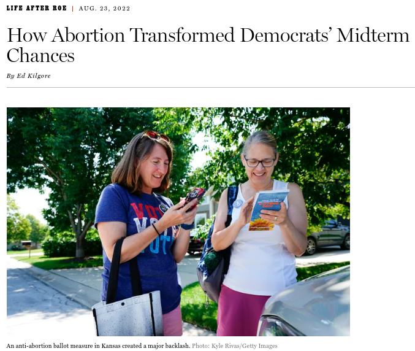

```{r setup, include=FALSE}
knitr::opts_chunk$set(echo = FALSE)
BurntOrange = rgb(191,  87,   0, maxColorValue = 255)
DarkGrey    = rgb( 51,  63,  72, maxColorValue = 255)
LightOrange = rgb(248, 151,  31, maxColorValue = 255)
LightGreen  = rgb(166, 205,  87, maxColorValue = 255)
DarkGreen   = rgb( 87, 157,  66, maxColorValue = 255)
Teal        = rgb(  0, 169, 183, maxColorValue = 255)
Blue        = rgb(  0,  95, 134, maxColorValue = 255)
```

##

```{r}

```

##

```{r}

```

##

```{r}

```

## Why Might Ideologues Act As Moderates?

I model a set of judges' choice of how far to go in adopting a controversial position, assuming

::: nonincremental

1. the court adopting the controversial policy can affect copartisan's electoral fortunes, and
2. the judges know this.

:::

## Why Might Ideologues Act As Moderates?

I find that

\begin{enumerate}[<+->]\color{gray}
\item \color<.>{black}even highly ideological judges may avoid controversial decisions because they care about the policy elected ideological allies can deliver;
\item \color<.>{black}this effect is more pronounced for politically savvy judges that can better estimate electoral costs of controversial decisions; and
\item \color<.>{black}the difference in controversy avoidance for politically savvy judges and politically naive ones is increasing in the electoral cost of the controversy
\end{enumerate}

## Modelling Appointed Judges' Electoral Concerns

. . .

The judges collectively choose $p \in [0, 1]$, or how far to go in adopting a controversial policy

. . .

Each judge $i$'s preferences can be represented by the utility function

$$
U_i(p; \alpha_i, \beta_i)
= {\color{DarkGreen}p\alpha_i} + {\color{Blue}\left( 1 - p^2 \right)\beta_i}
$$

\begin{tabular}{cp{0.7\textwidth}}
${\color{DarkGreen}p\alpha_i}$
& Policy benefit to $i$ of choosing $p$ \\
${\color{Blue}\left( 1 - p^2 \right)\beta_i}$
& Expected policy loss from electoral backlash against copartisans of choosing $p$
\end{tabular}

## Non-Moderate Judges May Avoid Controversy

```{r, fig.height = 3, fig.width = 5}
p = seq(from = 0, to = 1, by = 0.01)
u = function(p, a, b) p * a + (1 - p^2) * b
a = 1
b = 2
xticks = c(0, a / (2*b), a / b, 1)
xticklabs = c(0, expression(alpha / 2 * beta), expression(alpha / beta), 1)
yticklabs = expression(beta)
opar = par(mar = c(3, 3, 1, 1))
plot(
    x = p, y = u(p, a, b), type = "l", lwd = 2,
    main = "", xlab = "", ylab = "", xaxt = "n", yaxt = "n"
)
axis(side = 1, line = -0.75, at = xticks, labels = xticklabs, tick = FALSE)
axis(side = 2, at = b, line = -0.75, labels = yticklabs, tick = FALSE, las = 2)
mtext(side = 1, line = 1.5, text = expression(p))
mtext(side = 2, line = 1.5, text = expression(U[i](p)))
abline(v = min(1, a / (2*b)), lty = 3, lwd = 2)
abline(v = min(1, a / b), lty = 2, lwd = 2)
abline(h = b, lty = 2, lwd = 2)
par(opar)
```

## Non-Moderate Judges May Avoid Controversy

So, in equilibrium, the opinion author (labeled $a$) chooses the $p$ closest to $\alpha_a\, / \, 2\beta_a$ that is in the set $\bigcap_{i \in M} \, [0, \alpha_i \, / \, \beta_i]$ for a majority coalition $M$.

## Non-Moderate Judges May Avoid Controversy

\begin{center}
\begin{minipage}{0.9\textwidth}
\begin{block}{Proposition 1}
The maximum value of $p$ that a judge $i$ would accept is increasing in $\alpha_i$ and decreasing in $\beta_i$, and increasing in their ratio $\alpha_i / \beta_i$.
\end{block}
\end{minipage}
\end{center}

. . .

\vspace{\baselineskip}

- As $\beta_i$ increases, judge $i$ values ideological legislation more
- So, they avoid endangering chances of legislative majority and moderate $p$

## Non-Moderate Judges May Avoid Controversy

```{r, fig.height = 3, fig.width = 5}
p = seq(from = 0, to = 1, by = 0.01)
u = function(p, a, b) p * a + (1 - p^2) * b
a = 1
b1 = 1.5
b2 = 3
u1 = u(p, a, b1)
u2 = u(p, a, b2)
r = range(u1, u2)
xticks = c(0, a / b2, a / b1, 1)
yticks = c(b1, b2)
xticklabs = c(0, expression(alpha / beta[j]), expression(alpha / beta[i]), 1)
yticklabs = c(expression(beta[i]), expression(beta[j]))
opar = par(mar = c(3, 3, 1, 1))
plot(
    x = p, y = u1, type = "l", ylim = r, col = Blue, lwd = 2,
    main = "", xlab = "", ylab = "", xaxt = "n", yaxt = "n"
)
lines(x = p, y = u2, col = BurntOrange, lwd = 2)
axis(side = 1, line = -0.75, at = xticks, labels = xticklabs, tick = FALSE)
axis(side = 2, line = -0.75, at = yticks, labels = yticklabs, tick = FALSE, las = 2)
mtext(side = 1, line = 1.5, text = expression(p))
mtext(side = 2, line = 1.5, text = expression(U[i](p)))
abline(v = min(1, a / b1), lty = 2, col = Blue, lwd = 2)
abline(h = b1, lty = 2, col = Blue, lwd = 2)
abline(v = min(1, a / b2), lty = 2, col = BurntOrange, lwd = 2)
abline(h = b2, lty = 2, col = BurntOrange, lwd = 2)
par(opar)
```

## Non-Moderate Judges May Avoid Controversy

```{r, fig.height = 3, fig.width = 5}
a = 1
b = seq(from = 1, to = 5, length.out = 100)
p = pmin(1, a / b)
xticklabs = c(expression(alpha), expression(5*alpha))
opar = par(mar = c(3, 3, 1, 1))
plot(
    x = b, y = p, type = "l", lwd = 2, ylim = c(0, 1),
    main = "", xlab = "", ylab = "", xaxt = "n", yaxt = "n"
)
axis(side = 2, line = -0.75, at = c(0, 1), tick = FALSE, las = 2)
axis(side = 1, line = -0.75, at = c(1, 5), tick = FALSE, labels = xticklabs)
mtext(side = 1, line = 1.5, text = expression(beta))
mtext(side = 2, line = 1.5, text = expression(bar(p)), las = 2)
par(opar)
```

## This Effect is Larger for Politically Savvy Judges

- The judges may not know what the electoral backlash will be
- So we scale electoral backlash by randomly drawn multiplier $\Lambda(\kappa)$, where $\Lambda$ is the standard logistic function and $\kappa \sim \mathcal{N}(0, 1)$
- Each judge $i$ gets a signal $s_i \sim \mathcal{N}(\kappa, 1/\tau_i)$; $\tau_i$ is the precision of judge $i$'s signal
- Then $i$'s belief is distributed $$\kappa \mid s_i \sim \mathcal{N}\left(\frac{s_i \tau_i}{\tau_i + 1}, \frac{1}{\tau_i + 1}\right)$$
- And judge $i$'s expected utility of enacting $p$ is $$ EU_i(p; \alpha_i, \beta_i, \kappa) = {\color{DarkGreen}p\alpha_i} + {\color{Blue}\left( 1 - {\color{LightOrange}\Lambda(\hat{\kappa}_i)}\, p^2 \right)\beta_i},$$ where $\hat{\kappa}_i = \frac{s_i \tau_i}{\tau_i + 1}$

## This Effect is Larger for Politically Savvy Judges

\begin{center}
\begin{minipage}{0.9\textwidth}
\begin{block}{Proposition 2}
For two judges $i$ and $j$, $\tau_i > \tau_j$ implies

\begin{enumerate}[i]
\item $\mathbb{E}\left[|\hat{\kappa}_i - \kappa|\right] < \mathbb{E}\left[|\hat{\kappa}_j - \kappa|\right]$
\item $\mathbb{E}\left[|\hat{\kappa}_i|\right] > \mathbb{E}\left[|\hat{\kappa}_j|\right]$
\end{enumerate}
\end{block}
\end{minipage}
\end{center}

. . .

That is, when one judge has higher electoral discernment than another,

1. their estimate of the electoral cost will be more accurate, and moreover,
2. the estimate of the judge with lower electoral discernment will be biased toward zero

## This Effect is Larger for Politically Savvy Judges

In particular, when nature draws a high electoral cost, judges with low discernment will be

1. more likely not just to poorly estimate the electoral cost of the policy, but
2. specifically to underestimate its true electoral cost

## This Effect is Larger for Politically Savvy Judges

```{r, fig.height = 3, fig.width = 5}
expected_cost = function(cost, precision) (cost * precision) / (precision + 1)
tau = seq(1, 10, length.out = 100)
tau = seq(1/3, 3, length.out = 100)
kappa1 = 0.5
kappa2 = 2
kappa_hat1 = expected_cost(kappa1, tau)
kappa_hat2 = expected_cost(kappa2, tau)
r = range(c(kappa_hat1, kappa_hat2, 0, kappa2))
yticks = c(0, kappa1, kappa2)
yticklabs = c(0, expression(kappa), expression(kappa*"'"))
opar = par(mar = c(3, 3, 1, 1))
plot(
    x = tau, y = kappa_hat1, type = "l", ylim = r, col = Blue, lwd = 2,
    main = "", xlab = "", ylab = "", xaxt = "n", yaxt = "n"
)
lines(x = tau, y = kappa_hat2, col = BurntOrange, lwd = 2)
axis(side = 2, line = -0.75, at = yticks, labels = yticklabs, tick = FALSE, las = 2)
mtext(side = 1, line = 1, text = expression(tau))
mtext(side = 2, line = 1.5, text = expression(E(hat(kappa))))
abline(h = kappa1, lty = 2, col = Blue)
abline(h = kappa2, lty = 2, col = BurntOrange)
par(opar)
```

## This Effect is Larger for Politically Savvy Judges

```{r, fig.height = 3, fig.width = 5}
tau = seq(1, 10, length.out = 100)
tau = seq(1/3, 3, length.out = 100)
kappa1 = 0.5
kappa2 = 2
f = function(a, b, k, t) a / (plogis((k * t) / (t + 1)) * b)
a = 1
b = 2
p1 = f(a, b, kappa1, tau)
p2 = f(a, b, kappa2, tau)
r = range(p1, p2)
opar = par(mar = c(3, 3, 1, 1))
plot(
    x = tau, y = p1, type = "l", ylim = r, col = Blue, lwd = 2,
    main = "", xlab = "", ylab = "", xaxt = "n", yaxt = "n"
)
lines(x = tau, y = p2, col = BurntOrange, lwd = 2)
text(x = tau[50], y = p1[50] + 0.02, labels = expression(kappa), col = Blue)
text(x = tau[50], y = p2[50] + 0.02, labels = expression(kappa*"'"), col = BurntOrange)
mtext(side = 1, line = 0.5, text = expression(tau))
mtext(side = 2, line = 0.5, text = expression(bar(p)), las = 2)
par(opar)
```

## Contributions, Implications, and Next Steps

- A strand of the judicial politics literature \textcolor{gray}{(e.g. Wittington 2005)} argues elected officials may offload controversial decisions onto the courts, but here I show conditions under which that will not work
- Some strategies for measuring judges' preferences \textcolor{gray}{(e.g. Martin and Quinn 2002)} may scale politically savvy judges as more moderate than they actually are
- Should I keep this as a formal paper and perhaps go for a short paper format? Or should I try to extend this with an empirical application?
